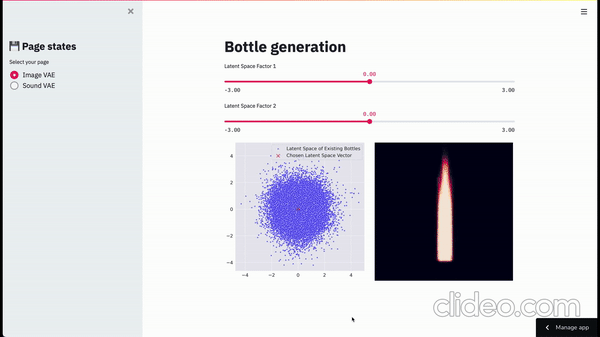

# variational_autoencoders

## Summary

This project applies Variational Autoencoder to produce new images and sounds.

The VAE for image data is fed with botte design images. Therefore the generative model is creating new
bottles designs which can be adjusted by changing the two latent representations with which the model
was trained.

The sound data is trained with three music genres, namely Techno, Rock and Piano music. This is done
by splitting hour-long remixes of these three genres into small ~1 second long snippets. The generative 
part of the model allows us then to creating new sound snippets which come from one of these three genres.

## Post

How Variational Autoencoder work is summarized and explained with the related blog-post on my website.

## Preview

The entire application is to be found [here](https://share.streamlit.io/data4help/crispy-train/src/app/vae_app.py).

### Image Preview

### Sound Preview

## Contribution

Pull requests are welcome, though unlikely that I come back to that project.

## License
[MIT](https://choosealicense.com/licenses/mit/)